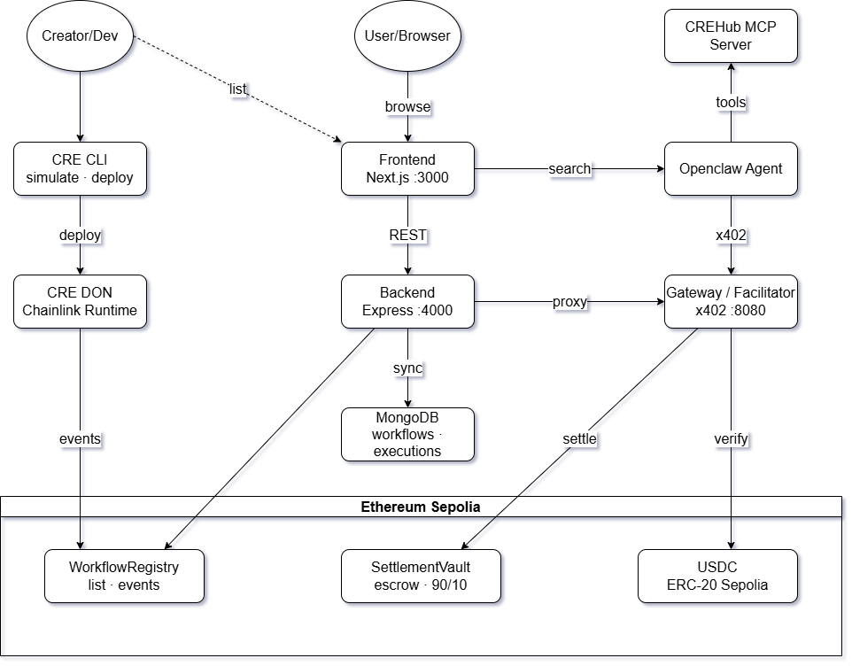

<div align="center">


<br/>

**The first decentralized marketplace for Chainlink CRE workflows.**
Creators monetize on-chain AI skills. AI agents discover, pay, and execute — per trigger, in USDC.

<br/>


</div>

---

## What is CREHub?

CREHub is a **pay-per-trigger marketplace** where developers publish Chainlink CRE workflows as premium on-chain capabilities and AI agents consume them autonomously — no subscriptions, no API keys, no gatekeepers.

An agent needs to check a DeFi health factor, run a technical analysis signal, or monitor a wallet balance? It searches CREHub, pays a few cents in USDC over the x402 protocol, and receives a verifiable result settled transparently on-chain. Creators earn **90% of every successful execution**, automatically, via smart contract escrow.

> Built on Chainlink CRE (Compute & Runtime Environment), x402 HTTP payment protocol, and Ethereum Sepolia — the full stack from workflow authoring to on-chain settlement in one cohesive system.

---

## System Architecture

<div align="center">
<picture>
  <source media="(prefers-color-scheme: dark)"  srcset="diagram/2 dark.png"/>
  <source media="(prefers-color-scheme: light)" srcset="diagram/2 light.png"/>
  
</picture>
</div>

<br/>

---

## End-to-End Flow

<div align="center">
<picture>
  <source media="(prefers-color-scheme: dark)"  srcset="diagram/system flow dark.png"/>
  <source media="(prefers-color-scheme: light)" srcset="diagram/system flow light.png"/>
  
</picture>
</div>

<br/>

```
1. CREATOR  →  crehub init → crehub test → crehub deploy → crehub list
               scaffold       simulate       WASM → DON     WorkflowRegistry.listWorkflow()

2. AGENT    →  GET  /api/workflows/search?q=aave+health+factor
               POST /api/trigger/wf_aave_health_monitor_01
                         ← 402 { payTo: 0xFBDf4D..., amount: "50000", token: USDC, chainId: 11155111 }
               broadcast USDC transfer on Ethereum Sepolia
               POST /api/trigger/... + X-Payment: <txHash>

3. GATEWAY  →  verifyEthSepoliaPayment()   — checks USDC Transfer log via viem
               SettlementVault.createEscrow()
               cre workflow simulate --target staging-settings
               SettlementVault.settleSuccess()  →  90% creator / 10% treasury
                         → 200 { success: true, output: { healthFactor: 2.049, riskLevel: "safe" }, settlementTx }
```

---

## Components

### crehub-cli — Developer Toolkit

A purpose-built CLI for CRE workflow creators. The entire lifecycle — scaffold, simulate, deploy, and list on-chain — in a single tool with an interactive terminal UI.

```
crehub init    — Scaffold a new CRE-compatible workflow (interactive prompts, generates all config files)
crehub doctor  — 14-point pre-deploy compatibility check (env, schema, CRE config, WASM, on-chain)
crehub test    — Run local CRE simulation + validate output against workflow schema
crehub deploy  — Compile TypeScript to WASM and deploy to the Chainlink DON
crehub list    — Register workflow metadata on WorkflowRegistry (Ethereum Sepolia)
crehub config  — Manage global CLI config stored at ~/.crehub/config.json
```


> Source: `crehub-cli/`

---

### CREHub MCP Server — Native AI Integration

A [Model Context Protocol](https://modelcontextprotocol.io) server that exposes the entire CREHub marketplace as native tools inside any MCP-compatible AI assistant (Claude Code, Cursor, Windsurf, etc.). This means Claude can search for, inspect, and trigger on-chain CRE workflows directly inside a conversation — without any extra tooling. It also features natural language parameter extraction: tell it _"check health factor for wallet 0x..."_ and it maps your intent to the correct workflow inputs automatically.

**Run the MCP server:**
```bash
cd mcp/crehub
npm install
npm run dev     # starts on http://localhost:3002
```

**Connect to Claude Code:**
```bash
# From the repo root
claude mcp add crehub -- npx tsx mcp/crehub/src/index.ts
```

**7 tools exposed:**

| Tool | What it does |
|------|-------------|
| `list_workflows` | Browse all active marketplace listings with price and category |
| `search_workflows` | Semantic search — find workflows by intent or description |
| `get_workflow_detail` | Full schema — inputs, outputs, price, creator address |
| `discover_workflow` | Auto-match natural language intent + extract typed parameters |
| `trigger_workflow` | Execute a workflow with full x402 USDC payment handling |
| `get_executions` | Paginated on-chain execution history (all workflows or filtered) |
| `get_execution` | Single execution record — output, settlement tx, CRE broadcast tx |

```jsonc
// .claude/mcp.json or claude_desktop_config.json
{
  "mcpServers": {
    "crehub": {
      "command": "npx",
      "args": ["tsx", "mcp/crehub/src/index.ts"],
      "env": { "BACKEND_URL": "http://localhost:4000" }
    }
  }
}
```

> Source: `mcp/crehub/`

---

### x402 Payment Gateway

The payment enforcement layer every workflow trigger flows through. It returns HTTP 402 on the first call, waits for the agent to broadcast a USDC transfer on Ethereum Sepolia, verifies the on-chain Transfer log, creates an escrow, runs the workflow, and settles — all in one atomic flow.

Key implementation details:
- **Manual Sepolia verifier** — x402 SDK only covers Base/Base-Sepolia natively; this gateway implements a lightweight `verifyEthSepoliaPayment()` using viem to parse the USDC Transfer event log directly
- **ETH-signed JWT** — authenticates requests to the Chainlink CRE Gateway using ECDSA/secp256k1 signature over a SHA-256 request digest (ported from the reference Python implementation)
- **SettlementVault integration** — `createEscrow()` before execution, `settleSuccess()` / `settleFailure()` after, emitting fully indexed on-chain events

```
POST /trigger/:workflowId    x402-protected  →  verify USDC → simulate → settle
GET  /workflows              listing proxy
GET  /health                 health check
```

**50/50 tests passing** — `cd gateway && bun test`

> Source: `gateway/`

---

### Marketplace Backend API

REST API that aggregates on-chain workflow data, serves semantic search, syncs executions to MongoDB, and proxies x402 triggers transparently to the gateway.

```
GET  /api/workflows                  — all active listings (from WorkflowRegistry or demo seed)
GET  /api/workflows/search?q=<query> — semantic search using sentence-transformer embeddings + cosine similarity
GET  /api/workflows/:workflowId      — workflow detail and metadata
POST /api/trigger/:workflowId        — transparent x402 proxy: passes 402 and payment through to gateway
POST /api/workflows/list             — creator submits a new listing
GET  /api/executions                 — paginated execution history (powers the Explorer)
GET  /api/executions/:executionId    — single execution with full output and settlement data
```

**Demo mode:** leave `WORKFLOW_REGISTRY_ADDRESS` empty → serves 6 built-in demo listings (Aave, Chainlink price feed, wallet monitor, proof of reserve, gas estimator, NFT floor price) with no chain dependency.

**37/37 tests passing** — `cd backend && bun test`

> Source: `backend/`

---

### Marketplace Frontend

Next.js 14 App Router marketplace with a Chainlink-aligned dark navy theme. Built for both human users and AI agents — every workflow page is also machine-readable JSON.

| Route | Description |
|-------|-------------|
| `/` | Animated landing — network node hero, featured workflows |
| `/browse` | Semantic search bar + category filter + animated workflow grid |
| `/workflow/[id]` | Detail page with sticky 4-step TriggerPanel (fill → 402 → pay → result) |
| `/list` | Creator listing wizard — 4-step form to submit a workflow on-chain |
| `/agent` | Agent Console — chat-style MCP interaction in the browser |
| `/explorer` | On-chain Execution Explorer — every settled tx with Etherscan links |
| `/crehub/openclaw` | Rendered Openclaw skill docs (also served as raw `.md` for agents) |

The TriggerPanel walks a user through the full x402 payment flow — connect wallet → see payment details → broadcast USDC → submit tx hash → receive verified result — entirely in-browser with RainbowKit.

> Source: `frontend/`

---

### Smart Contracts — Ethereum Sepolia

**WorkflowRegistry** is the on-chain source of truth for all CREHub listings. Creators call `listWorkflow()` with their metadata, and it becomes permanently discoverable on-chain with full execution history.

**SettlementVault** handles the escrow lifecycle: it holds USDC from the x402 payment, conditionally splits it after workflow execution, and records every outcome on-chain as a permanently queryable `ExecutionRecord`.

| Outcome | Creator | Protocol Treasury | Agent Refund |
|---------|:-------:|:-----------------:|:------------:|
| ✅ Success | **90%** | 10% | — |
| ❌ Failure | — | 1% | **99%** |

Both contracts emit fully indexed events — `ExecutionTriggered` and `ExecutionSettled` — making every marketplace transaction verifiable on Etherscan.

**30/30 tests passing** — `cd contracts && forge test --summary`

> Source: `contracts/`

---

### Openclaw — Agent Skill (SKILL.md)

An [Openclaw](https://agentskills.io/specification)-compatible skill file that lets any compliant AI agent autonomously discover, pay for, and execute CREHub workflows without any custom integration. The agent reads `SKILL.md`, understands the API, handles x402 payment, and returns typed results — all from a single discoverable entry point.

```
SKILL.md                       — entry point, runtime pattern, quick reference
references/api.md              — full API surface + request/response shapes
references/payment-flow.md     — x402 step-by-step: 402 → pay USDC → X-Payment header
references/workflow-schema.md  — data types, price format, input/output field definitions
examples/agent-demo.md         — complete end-to-end agent walkthrough
```

All files served as raw `.md` and rendered HTML from the frontend at `/crehub/openclaw`.

> Source: `openclaw/`

---

### CRE Workflows — Live Implementations

Production-ready Chainlink CRE workflows shipped in the repo, each with full config, YAML targets, test payloads, and on-chain metadata:

| Workflow | Workflow ID | Price | Description |
|----------|-------------|-------|-------------|
| Aave Health Monitor | `wf_aave_health_monitor_01` | $0.05 USDC | Health factor, risk level, position breakdown for any Aave v3 address |
| TA Signal | `wf_ta_signal_01` | $0.10 USDC | RSI, MACD, Bollinger Bands signal (BUY/SELL/HOLD) for any trading pair |
| Hello World | `wf_hello_world_01` | — | Minimal reference implementation for creators |

Each workflow is CRE-locked to the CREHub gateway public key — only the CREHub gateway can trigger them, preventing unauthorized direct execution.

> Source: `workflows/`

---

## Deployed Contracts — Ethereum Sepolia

| Contract | Address | Etherscan |
|----------|---------|-----------|
| `WorkflowRegistry` | `0xb2fb76A7DFF182c957dF5586697a2B76Cb49709e` | [↗](https://sepolia.etherscan.io/address/0xb2fb76A7DFF182c957dF5586697a2B76Cb49709e) |
| `SettlementVault` | `0xf50513FC4f4C248eAF6F72F687f0A91B5FDc2E60` | [↗](https://sepolia.etherscan.io/address/0xf50513FC4f4C248eAF6F72F687f0A91B5FDc2E60) |
| `WorkflowResultStore` | `0xD4CE3309d05426446f3E778Dd294F00beBf3A12a` | [↗](https://sepolia.etherscan.io/address/0xD4CE3309d05426446f3E778Dd294F00beBf3A12a) |
| `USDC (Circle Sepolia)` | `0x1c7D4B196Cb0C7B01d743Fbc6116a902379C7238` | [↗](https://sepolia.etherscan.io/address/0x1c7D4B196Cb0C7B01d743Fbc6116a902379C7238) |

| Wallet | Address | Role |
|--------|---------|------|
| Gateway / Platform | `0xFBDf4Dc13ed423C1E534Da0b2ed229B6a376a31f` | Receives x402 USDC payments |
| Treasury | `0x1EF7F4c06cB7630FdcB5DD324f22C0A8Ec85F93F` | Receives protocol fees (10% / 1%) |
| CRE Executor | `0x2b8Ad3f705Db838508bF93665FC1EcC361390Aa3` | CRE DON forwarder / executor |
| Agent (demo) | `0xd5ce188fFae83BdF5Fb27EbFafCc29fA11DCd50E` | AI agent wallet used in demo runs |

---

## Live Transaction Proof — 46 Executions On-Chain

All executions are visible at **[/explorer](http://localhost:3000/explorer)** on the running frontend.

### Latest 3 Settled Executions

**#1 — TA Signal · SOL/USDT · 5m · HOLD** _(2026-03-07 14:34 UTC)_

| Field | Hash |
|-------|------|
| USDC Payment tx | [`0x31712f7d...`](https://sepolia.etherscan.io/tx/0x31712f7d2fd0d25c7818c375a80e25ee3b4eb2f6e529882db917db5455f51d20) |
| Settlement tx (`ExecutionSettled`) | [`0x9e90687...`](https://sepolia.etherscan.io/tx/0x9e90687023b89289c716df372262acd06fc0beb12b63d9cafeed88bd57f8ae09) |
| CRE Broadcast tx (`WorkflowResultStore`) | [`0x877bb17...`](https://sepolia.etherscan.io/tx/0x877bb17314e6e9fded288ed0dacaa535adb33c8dc28e5bffa72c2476cae5ca9a) |

**#2 — Aave Health Monitor · HF 2.049 · safe** _(2026-03-07 14:28 UTC)_

| Field | Hash |
|-------|------|
| USDC Payment tx | [`0x3e7517d...`](https://sepolia.etherscan.io/tx/0x3e7517dfcb7bd9485b052a991bcb60072320a3aad710534e9264788e4a8f3024) |
| Settlement tx (`ExecutionSettled`) | [`0x7dcb50c...`](https://sepolia.etherscan.io/tx/0x7dcb50ca7b668a1f399a68d76ca6f726e34759b40a9300748b152c2576620666) |
| CRE Broadcast tx (`WorkflowResultStore`) | [`0x673a248...`](https://sepolia.etherscan.io/tx/0x673a248a06d441135081cd66de0885e2082a81c047f46250a3cd94af98af43f7) |

**#3 — TA Signal · BTC/USDT · 1h · BUY** _(2026-03-07 14:25 UTC)_

| Field | Hash |
|-------|------|
| USDC Payment tx | [`0x0434be5...`](https://sepolia.etherscan.io/tx/0x0434be53e7cca1c00c786a20c77c9f8ab0a6750bd0927ac4576560acac2f0604) |
| Settlement tx (`ExecutionSettled`) | [`0x0d0b0c3...`](https://sepolia.etherscan.io/tx/0x0d0b0c355a23d76be839010d1582d69b4c841220c8b3f8e234f71f68f8d8a955) |
| CRE Broadcast tx (`WorkflowResultStore`) | [`0xfce8ada...`](https://sepolia.etherscan.io/tx/0xfce8adade748b850b49d6ebc60bab9afa075707052104b02cc772d06ae3a3a80) |

Each execution has three verifiable on-chain proofs: the USDC payment transfer, the escrow settlement event from `SettlementVault`, and the CRE workflow result recorded in `WorkflowResultStore` by the Chainlink CRE Forwarder.

---

## Quick Start

### Prerequisites

- [Bun](https://bun.sh) ≥ 1.2
- [Foundry](https://getfoundry.sh) (for contracts only)
- Node.js 18+ (for Next.js frontend)

### Run the full stack

```bash
# 1. Install dependencies
bun install

# 2. Copy and fill environment files
cp gateway/.env.example gateway/.env        # fill GATEWAY_PRIVATE_KEY + contract addresses
cp frontend/.env.local.example frontend/.env.local  # fill NEXT_PUBLIC_WALLETCONNECT_PROJECT_ID

# 3. Start everything (gateway :8080 + backend :4000 + frontend :3000)
bash start-demo.sh
```

| Service | URL |
|---------|-----|
| Marketplace UI | http://localhost:3000 |
| Browse workflows | http://localhost:3000/browse |
| Execution Explorer | http://localhost:3000/explorer |
| Agent Console | http://localhost:3000/agent |
| Openclaw skill | http://localhost:3000/crehub/openclaw |
| Backend API | http://localhost:4000/api/workflows |
| Payment Gateway | http://localhost:8080 |
| MCP Server | http://localhost:3002 (start separately: `cd mcp/crehub && npm run dev`) |

---

## Running Tests

```bash
bun run test:gateway     # gateway     — 50 tests
bun run test:backend     # backend     — 37 tests
bun run test:contracts   # contracts   — 30 tests (requires Foundry)

bun test                 # gateway + backend combined (87 tests)
```

---

## Repository Structure

```
CREHub/
├── crehub-cli/             — Creator developer toolkit (init · doctor · test · deploy · list)
├── mcp/
│   └── crehub/             — MCP server (7 tools for Claude Code and AI IDEs)
├── gateway/                — x402 Payment Gateway (TypeScript · Express · viem)
├── backend/                — Marketplace REST API (semantic search · MongoDB · viem)
├── frontend/               — Next.js 14 Marketplace UI (RainbowKit · Wagmi · Framer Motion)
├── contracts/              — Solidity/Foundry (WorkflowRegistry + SettlementVault)
├── openclaw/               — SKILL.md + references (Openclaw agent skill)
├── workflows/
│   ├── aave-health-monitor/ — Live Aave v3 health factor workflow
│   ├── ta-signal/           — Live technical analysis signal workflow
│   └── hello-world/         — Minimal creator reference template
├── diagram/                — Architecture and flow diagrams
├── scripts/
│   └── broadcast-workflows.ts  — Bulk-register workflows on-chain
├── start-demo.sh           — One-command full stack launcher
└── ARCHITECTURE.md         — Phase-by-phase architecture spec
```

---

## Key Technical Decisions

| Decision | Choice | Why |
|----------|--------|-----|
| Payment network | Ethereum Sepolia (chainId 11155111) | Matches CRE staging environment |
| x402 verifier | Manual viem verifier | x402 SDK covers Base/Base-Sepolia only natively |
| USDC | Circle official Sepolia contract | Same address used in CRE ecosystem |
| Demo execution | `cre workflow simulate` | Full end-to-end without DON deployment |
| JWT for CRE auth | ETH-signed JWT (ECDSA/secp256k1) | CRE Gateway requires this exact format |
| Fee split success | 90% creator / 10% protocol | Creator-first economics |
| Fee split failure | 99% refund / 1% ops | Agents protected from broken workflows |
| Workflow lock | `AuthorizedKey = CREHUB_GATEWAY_PUBKEY` | Only CREHub gateway can fire a workflow |
| Agent interface | SKILL.md (agentskills.io spec) | Openclaw-native standardized discovery |
| MCP transport | Streamable HTTP (MCP SDK) | Supports Claude Code + desktop clients |
| Compiler flag | `via_ir = true` (Foundry) | Avoids stack-too-deep on large structs |
| Frontend SSR | `ssr: false` for wallet providers | WalletConnect requires browser `indexedDB` |

---

## Tech Stack

| Layer | Stack |
|-------|-------|
| CRE Workflows | TypeScript · Chainlink CRE SDK |
| Developer CLI | Bun · `@clack/prompts` · viem · zod |
| MCP Server | `@modelcontextprotocol/sdk` · Express · TypeScript |
| Payment Gateway | Express · viem · ethers · x402 |
| Backend API | Express · `@xenova/transformers` · MongoDB · viem |
| Frontend | Next.js 14 · Tailwind CSS · Framer Motion · RainbowKit v2 · Wagmi v2 |
| Smart Contracts | Solidity 0.8.24 · Foundry · OpenZeppelin |
| Network | Ethereum Sepolia · Circle USDC |

---

## License

MIT
